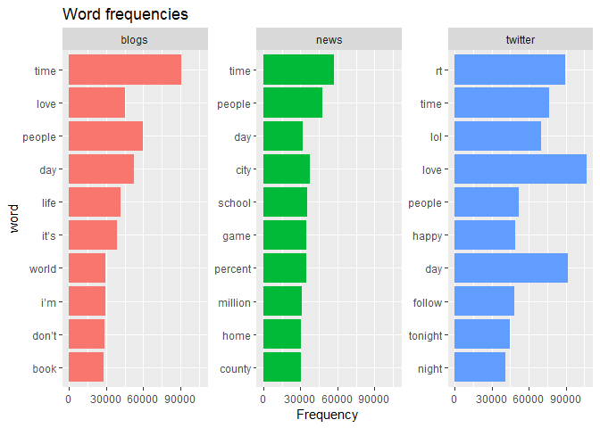
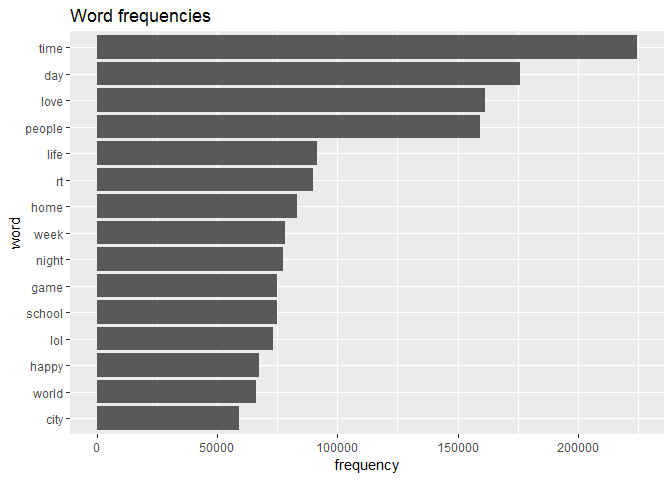
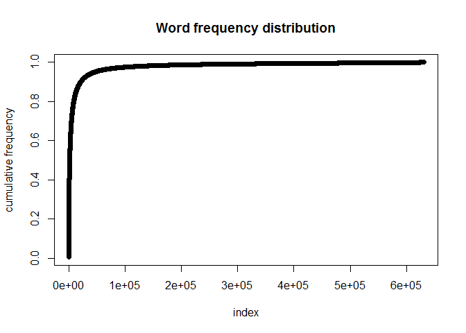
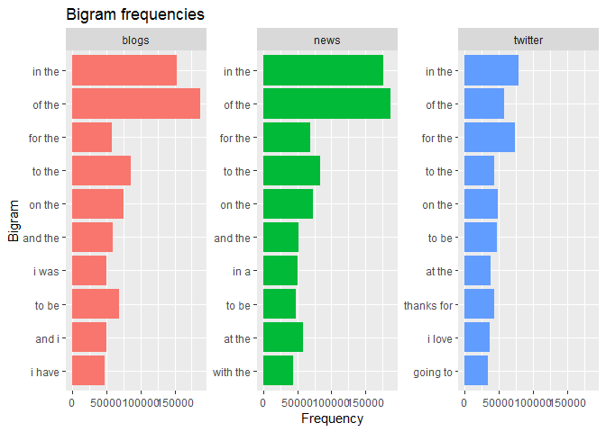
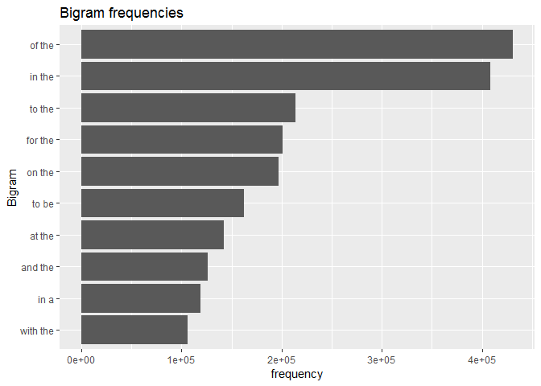
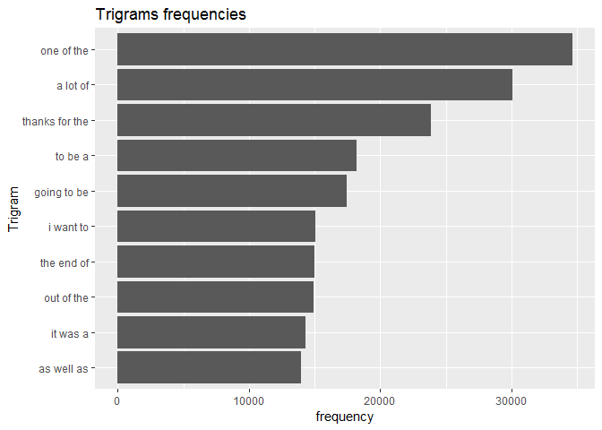

## Introduction

In this project we are going to create a predictive text model which will take input phrase from the user and predict the next word. 

For example, when someone types:

"I went to the"

the keyboard presents three options for what the next word might be. For example, the three words might be gym, store, restaurant. In this project we will work on understanding and building predictive text models like those used by SwiftKey. The application will be hosted on a Shiny server.

## The data

The data used for this project can be found in the following location:
https://d396qusza40orc.cloudfront.net/dsscapstone/dataset/Coursera-SwiftKey.zip

The data are taken from three different sources: Blogs, News and Twitter.
Let's look at the amount of data present in the corpus.

The total number of sentences and words in blogs, news and twitter files are shown in the table below:

Source  |   Line Count  | Word Count
--------|---------------|---------------
Blog    | 899288 |37334131
News    | 1010242  |34372529
Twitter |2360148|30373543

### Cleaning of data

The raw data obtained above may contain some words which are not useful for our analysis such as: numerics, special characters and profane words. 
So we will removed them. 

After removing these words, the final data looks like this:

Source  |   Line Count   | Word Count
--------|----------------|------------
Blog    | 899288 |37175916
News    | 1010242  |34065534
Twitter |2360148|30180375

## Exploratory data analysis

### Analyzing single words

Now that we know how much data is present in them, we can explore more to find out the most frequently occurring words.

For this we will remove single letters (such as "a", "I") and stop words (such as "the", "as", "are" etc), as they will show up in huge numbers and will bias our analysis.

After performing the cleaning, here are the top 10 most common words across various sources.

<!-- -->

We can see there are few words such as "time", "people", "love" which are highly used across all sources.
Now let's look at the overall most commonly used words across the entire corpus.

<!-- -->

As we can see some words are more frequent that others, we can observe which words contribute more to the corpus by looking at the following plot.

<!-- -->

We can see from the plot above that the 90% of unique words come from aproximately 3% of the entire corpus data. We can use this information to optimise our dictionary.

### Analyzing Bigrams

Bigrams consist of a combination of two words.
Now we will look at the distribution and frequency of the bigrams across various sources.

<!-- -->

We will also look at the bigram distributions in the entire corpus.

<!-- -->

### Analyzing Trigrams

We will perform similar analysis for trigrams. Trigrams are a combination of three words.

<!-- -->

## Summary and plan for Shiny app

1. More than 90% of the corpus is built using less than 10% of all the unique words/N-grams. So we can optimise our dictionary by removing low frequency word. For bigram and trigram we will be considering words with frequency more than 5 (n > 5).
2. For prediction we will consider the word with the highest frequency that matches with the given user input. Higher order N-grams will be given priority and if no match is found then subsequent lower order N-grams will be considered.
3. Next step is to tune the prediction algorithm and deploy the same on Shiny server.
